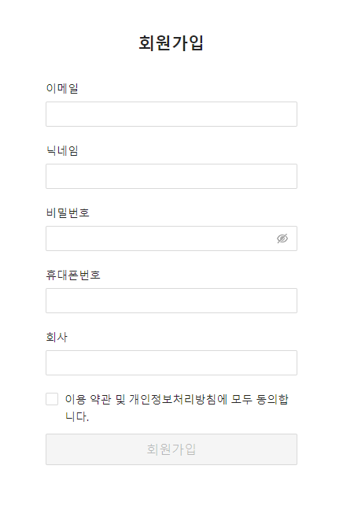

## React.js 회원가입 폼 레거시 코드를 Atomic Design을 적용해 비지니스 로직 분리 및 개선

### 환경

React, next.js, Ant Design

### 케이스 주제

Atomic Design을 적용하지 않아 반복적인 스타일 및 비 효율적인 구분으로 인해 가독성이 떨어지는 레거시 코드를
Atomic Design 적용을 통해 컴포넌트 / 스타일 정리 및 비지니스 로직 분리 개선

### 기능 요구사항

1. 회원가입 폼 레거시 코드를 리팩토링 해 Atomic Design을 반영한 코드로 개선

### 기능작동이미지

### 문제

/pages/legacy/join.js 코드를 리팩토링 해 /pages/refactoring/join.js 로 개선
