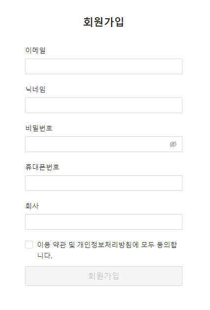

## Case6 : Case5에 이어 React.js 회원가입 폼 Validation 개선

### 환경

React, next.js, Ant Design, React Hook Form, Yup

### 케이스 주제

회원가입 시 필요한 Validation 기능에 대해 직관적이지 않게 직접 처리한 레거시 코드를 React Hook Form을 활용해 개선

### 기능 요구사항

1. if-else 문으로 일일히 validation 처리 하는 레거시 코드를 react-hook-form, yup 을 통해 개선

### 기능 작동 이미지

### 문제

/components/organism/legacy/JoinForm.js 코드를
리팩토링 해 /components/organism/refactoring/JoinForm.js 로 개선
