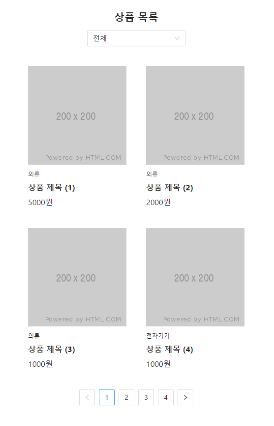

## Case7 : 단순 고정 URL방식의 리스트 페이지를 Query String 방식 URL로 변경

### 환경

React, next.js, Mobx

### 케이스 주제

단순 고정 URL방식의 리스트 페이지를 Query String 방식 URL로 변경해 사용성 높히기

### 기능 요구사항

1. 기존의 페이지네이션, 필터 적용 등의 기능에 대해 URL을 고려하지 않고 작성한 코드를 query string url 방식으로 개선해
   사용성 개선 및 코드 단순화 (Mobx 활용)

### 기능 작동 이미지

### 문제

Mobx를 활용해 pages/legacy/list.js 를 query string url 방식으로 pages/refactoring/list.js 파일에 개선
