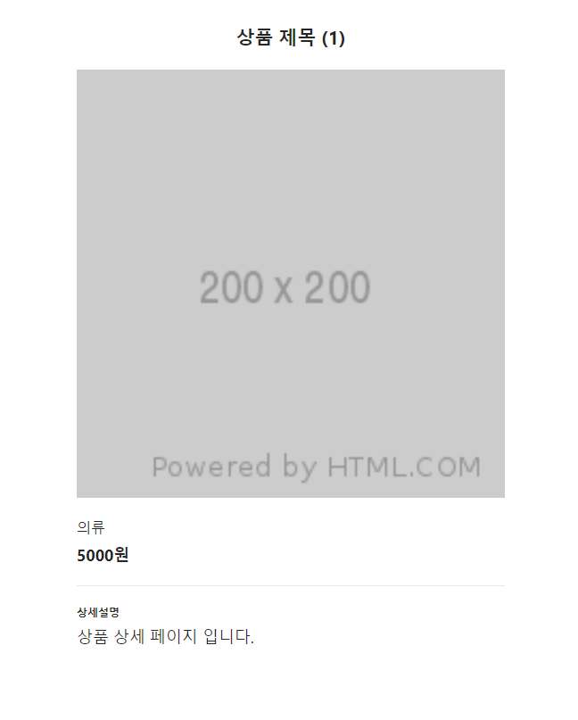

## Case8 : 반복적으로 사용되는 &lt;head&gt; 개선

### 환경

React, next.js, Mobx

### 케이스 주제

Next.js SEO를 위한 HOC (Higher Order Components)를 이용해 반복적으로 사용되는 &lt;head&gt; 개선하기

### 기능 요구사항

1. Next.js 에서 SSR의 장점인 SEO를 위해 &lt;head&gt; 의 og-tag 등을 페이지마다 다르게 주기 위해 매 페이지마다 반복적으로 사용되는
   NextHead 코드를 HOC을 활용해 개선

### 기능 동작 이미지

### 문제

/page/legacy/[pid].js 의 상세 페이지 헤드를 HOC을 작성해 /page/refactoring/[pid].js에 작성한다.
