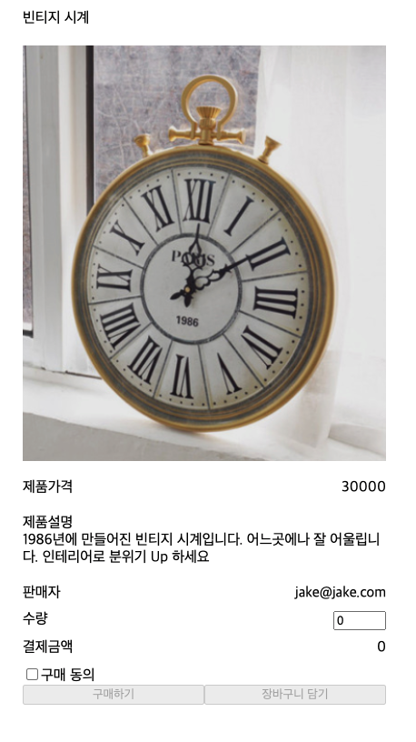

## Case1 : React, Storybook, Jest를 이용한 TDD 개발(Intro)

### 케이스 주제

제품의 상세페이지가 담겨있는 페이지를 Storybook을 이용해 구현하고,  
Jest를 이용하여 검증가능한 코드를 만든다.

### 기능 요구사항

1. 화면

- (주어진)제품 정보가 나타나는 화면을 만든다.

`./src/__fixtures__/products/vintage_clock.json`

- 수량을 입력할 수 있다.
- 구매동의를 선택할 수 있다.
- 수량이 1개이상이고 구매동의가 되었을때 구매하기가 가능하다.
- 수량이 1개이상일때 장바구니 담기가 가능하다.

2. 테스트

- 주어진 제품정보가 잘 표현되는지 검증한다.
- 결제금액이 제품 가격과 수량에 연동되어 변경된다.
- 구매하기, 장바구니 담기가 조건에 따라 활성화/비활성화 된다.

### 기능 작동 이미지

##### <적용 후>



### 문제

기능 요구사항을 만족하는 화면과 테스트 코드를 작성하시요

### 주요 학습 키워드

- TDD(CDD)
  > (컴포넌트) 테스트 작성 -> 테스트 실행 -> 코드 작성 -> 테스트 실행 -> 리팩토링 -> 테스트 작성(반복)  
  > [The more your tests resemble the way your software is used, the more confidence they can give you.](https://testing-library.com/docs/)
- React
  > UI Component Library
- Storybook
  > UI를 독립적으로 구축하기 위한 도구입니다. UI 개발, 테스트, 문서화를 간소화합니다.
- Jest
  > 유쾌한 JavaScript 테스팅 프레임워크
- dom & dom selector
- [testing-library](https://ko.reactjs.org/docs/test-utils.html)
  > React Testing Library는 React 구성 요소 작업을 위한 API를 추가하여 DOM Testing Library 위에 빌드됩니다.

### 작성해주셔야 하는 question 파일경로

#### 모듈

`.src/question/Case1.stories.js`

#### 테스트 코드

`.src/question/Case1-question.test.js`

### 실행 방법 및 의존성 모듈 설치

#### 의존성 모듈 설치

```
yarn install

npm install
```

#### 실행 방법

```
yarn run storybook

yarn run test

yarn run test Case1-question

yarn run test Case1-solution
```
