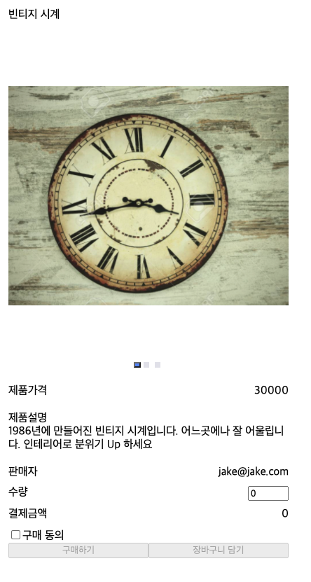

## Case2 : React, Storybook, Jest를 이용한 TDD 개발(기능확장과 컴포넌트 분리)

### 케이스 주제

제품의 상세페이지가 담겨있는 페이지를 Storybook을 이용해 구현하고,  
Jest를 이용하여 검증가능한 코드를 만든다.  
Case1에서 기능을 확장한다. => 이미지 슬라이더 컴포넌트 구현(이미지)

### 기능 요구사항

1. 화면

- 제품의 이미지가 여러개 존재할 수 있다.
- 제품의 이미지가 없을 경우 기본 이미지가 보인다.

2. 테스트

- 새로 추가된 요구사항에 만족하는 테스트

### 기능 작동 이미지

##### <적용 후>

