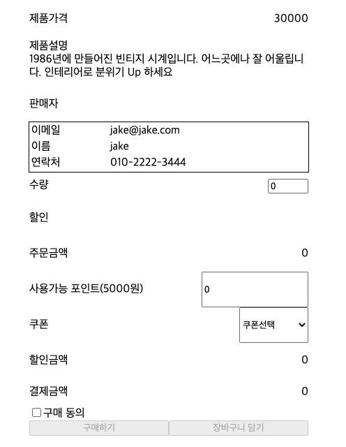

## Case4: React, Storybook, Jest를 이용한 TDD 개발(판매자 정보를 서버에서 불러온다)

### 케이스 주제

제품의 상세페이지가 담겨있는 페이지를 Storybook을 이용해 구현하고,  
Jest를 이용하여 검증가능한 코드를 만든다.
Case3에서 기능을 확장한다. => seller 컴포넌트 구현

### 기능 요구사항

1. 판매자 정보 api를 이용하여 받아오기(가상으로)

2. 테스트

- 새로 추가된 요구사항에 만족하는 테스트

### 기능 작동 이미지

##### <적용 후>



### 문제

기능 요구사항을 만족하는 화면과 테스트 코드를 작성하시요

### 주요 학습 키워드

- TDD
  > (컴포넌트) 테스트 작성 -> 테스트 실행 -> 코드 작성 -> 테스트 실행 -> 리팩토링 -> 테스트 작성(반복)  
  > [The more your tests resemble the way your software is used, the more confidence they can give you.](https://testing-library.com/docs/)
- React
  > UI Component Library
- Storybook
  > tool for building UI in isolation. It streamlines UI development, testing, and documentation.
- Jest
  > delightful JavaScript Testing Framework
- dom & dom selector
- [testing-library](https://ko.reactjs.org/docs/test-utils.html)
  > React Testing Library builds on top of DOM Testing Library by adding APIs for working with React components.

### 작성해주셔야 하는 question 파일경로

#### 모듈

`.src/question/Case4.stories.js`

#### 테스트 코드

`.src/question/Case4-question-.test.js`

### 실행 방법 및 의존성 모듈 설치

#### 의존성 모듈 설치

```
yarn install

npm install
```

#### 실행 방법

```
yarn run storybook

yarn run test

yarn run test Case4-question

yarn run test Slider

yarn run test Discount

yarn run test Seller

yarn run test Case4-solution
```
